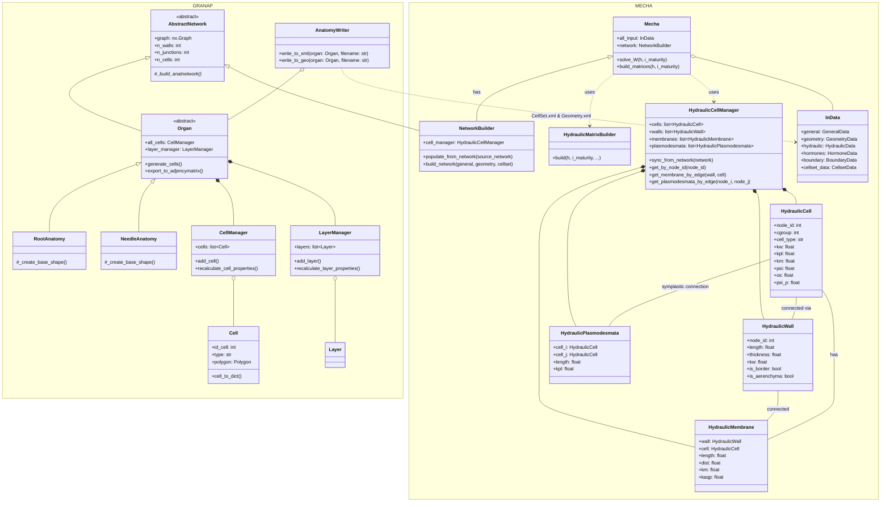
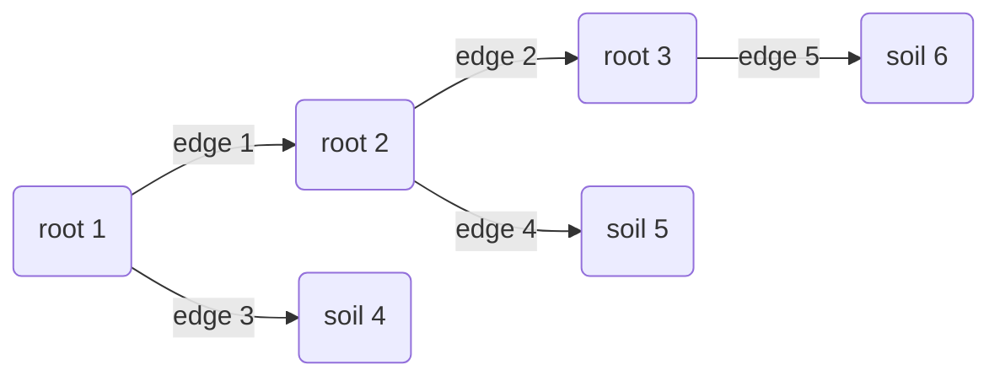

# Meeting notes — April 2026

---

## Organ generation using GRANAP + coupling with MECHA

Two construction pathways exist to build a hydraulic network in MECHA: the **XML path** (legacy) and the **GRANAP path** (new). Both converge on a `NetworkBuilder` that feeds into `Mecha`.



---

## Notes on Github

The general workflow on the repo is:

1. Make an issue
2. Make a branch from `ganache` with a prefix (`feature/` , `test/` , `fix/`, etc.) and a short description of the branch (e.g. `feature/solve_W_with_granap`) related to the issue you made.
3. Commit on that branch (often multiple times) using the `#<ISSUE_NUMBER>` tag in the commit message.
4. Test your code. Make sure it compiles and runs.
5. Update the documentation if needed (e.g. `python` documentation, `README`, etc.)
6. Rebase the branch to the latest version of `ganache` before making the pull request.
7. Create a pull request to `ganache`.

---

## Matrix W — Hydraulic conductance (Doussan)

`matrix_W` encodes all hydraulic conductivities in the cross-section. It is assembled in `HydraulicMatrixBuilder.build()` as a **COO sparse matrix** (via `scipy.sparse.coo_matrix`). The matrix is symmetric and Laplacian-like.

### Node indexing

| Index range | Node type | Description |
|---|---|---|
| `[0 .. n_walls - 1]` | Wall nodes | Apoplastic segments (mid-wall) |
| `[n_walls .. n_wall_junction - 1]` | Junction nodes | Corners where walls meet |
| `[n_wall_junction .. n_wall_junction + n_cells - 1]` | Cell nodes | Symplastic compartments |

### Edge types and conductance formula

For each edge `(i, j)`, the off-diagonal entry is `+K` and both diagonal entries accumulate `-K`:

```
W[i, i] -= K
W[i, j] += K
W[j, i] += K
W[j, j] -= K
```

| Edge path | Connects | Conductance `K` |
|---|---|---|
| `wall` | wall ↔ junction | `kw_tissue * 1e-4 * (lateral_dist + height) * thickness / length` |
| `membrane` | wall ↔ cell | `1 / (1/kw_half_wall + 1/(kmb + kaqp)) * 1e-8 * (height + dist) * length` |
| `plasmodesmata` | cell ↔ cell | `kpl * fplxheight_tissue * 1e-4 * length` |

### Boundary conditions

- **Soil**: border wall/junction nodes get `-K_soil` on diagonal; RHS = `-K_soil * ψ_soil`
- **Xylem**: xylem cell nodes get `-k_xyl` on diagonal; RHS += `-k_xyl * ψ_xyl`
- **Phloem** (barrier=0 only): protosieve cell nodes get `-k_sieve`; RHS += phloem pressure or flow

### Simplified 3-node example (Doussan 1998)



Doussan incidence matrix:

| | edge[1] | edge[2] | edge[3] | edge[4] | edge[5] |
|---|---|---|---|---|---|
| root_nodes[1] |-1 | 0 |-1 | 0 | 0 |
| root_nodes[2] | 1 |-1 | 0 |-1 | 0 |
| root_nodes[3] | 0 | 1 | 0 | 0 |-1 |
| soil_node[4]  | 0 | 0 | 1 | 0 | 0 |
| soil_node[5]  | 0 | 0 | 0 | 1 | 0 |
| soil_node[6]  | 0 | 0 | 0 | 0 | 1 |

### MECHA matrix_W structure

Unlike the simplified Doussan above, the MECHA `matrix_W` operates on **all walls + junctions + cells** simultaneously. Its size is `(n_walls + n_junctions + n_cells) × (n_walls + n_junctions + n_cells)`. 

---

## Matrix C — Solute transport / Advection-Diffusion

`matrix_C` encodes **diffusion and active transport** of solutes (e.g., hormones, ABA). It is only assembled when `boundary.c_flag == True` **and** `general.c_flag == True`.

### Structure

Same node indexing as `matrix_W`. Assembled as COO sparse matrix. Antisymmetric contributions arise from **carrier-mediated** (directional) transport.

| Edge type | Diffusion coefficient | Notes |
|---|---|---|
| `wall` (apoplast) | `diff1_pw1` (hormones.diff1_pw1) | Wall diffusivity, same geometry factor as `kw` |
| `plasmodesmata` (symplast) | `diff1_pd1` (hormones.diff1_pd1) | Scaled by `pd_section * temp_factor / thickness` |
| `membrane` (xylem) | `diff1_pw1` | Special case: xylem lumen at barrier≥1 |

### Carrier-mediated transport

For each `carrier_elem` (defined in `HormoneData`), if the carrier is active in a given `cgroup`:

- `direction = +1` → influx into cell: `C[cell, wall] += temp_c`, `C[wall, wall] -= temp_c`
- `direction = -1` → efflux from cell: `C[cell, cell] -= temp_c`, `C[wall, cell] += temp_c`


### Coupling with advection (AdvectionDiffusion)

Currently `HydraulicMatrixBuilder.build()` returns:

```python
matrix_W, matrix_C, rhs_C, rhs_p, rhs_x, rhs_s, rhs, Kmb
```

The full advection-diffusion problem couples the two:

```
W · ψ = rhs          → water potential field
C · c = rhs_C + v·∇c  → solute field (advected by flow v = -K·∇ψ)
```

The velocity field `u` appears in osmotic potential gradient calculations (`osmotic_diffusivity_soil`, `osmotic_diffusivity_xyl`).

---

## Implementation

### Do we need an `AdvectionDiffusionSolver` class?

**Proposal:** Extend `HydraulicMatrixBuilder` / add a thin `AdvectionDiffusionSolver` wrapper that:

1. Calls `Mecha.build_matrices()` to get `matrix_W` and `matrix_C`
2. Solves `W · ψ = rhs` → water potential
3. Computes edge fluxes `q_ij = K_ij * (ψ_i - ψ_j)` → velocity field
4. Assembles advection contribution into `matrix_C` (upwind scheme)
5. Solves `C · c = rhs_C` → solute concentration

The main open question is whether the coupling is **one-way** (ψ → c) or **iterative** (ψ ↔ c via osmotic feedback, `c_flag` loop).

---

### Mesophyll cells in Needles

- **Palisade mesophyll cells**: elongated, tightly packed.
- **Spongy mesophyll cells**: irregularly shaped with large air spaces → intercellular space geometry matters for gas-phase diffusion.
- **Cell surface**: need better representation of infoldings (increase in membrane surface). The specific cell surface (`area / perimeter`) should be stored in the `CellManager` and propagated to membrane conductance calculations.
- **Air spaces**: intercellular spaces between spongy mesophyll cells act as gas-phase channels for CO₂/H₂O → treated as `air space` type in `CellManager`.

### Transfusion Tracheids and Transfusion Parenchyma

- **Transfusion tracheids**: dead cells with thick lignified walls — currently mapped to `cgroup=13` (xylem-like). Their cell walls need a specific `kw` value.
- **Transfusion parenchyma**: living cells with plasmodesmata connections to transfusion tracheids — currently `cgroup=5` (stele/parenchyma). The plasmodesmata conductance at the tracheid↔parenchyma interface needs a dedicated `kpl` factor (analogous to `phloem_companion_cell_factor` for the phloem). In addition we would need to connect them with neighbouring parenchyma cells.
- **Cell wall representation**: Current wall thickness from `GeometryData.thickness` is uniform. Need cell-type-specific thickness for heavily lignified cells.

### Sub-stomatal chamber as evaporation-only boundary condition

- The sub-stomatal chamber is the intercellular space directly below the stoma.
- Boundary condition: **evaporation sink only** — no liquid water flow in, only water vapour efflux.
- Implementation: tag the sub-stomatal chamber cell as a special `border_aerenchyma` wall with:
  - `K_liquid = 0` (no apoplastic inflow)
  - `rhs[wall_id] = -E_stomata` (evaporation flux, mol/m²/s × conversion)
- The stomatal conductance `g_s` modulates this flux and should be a scenario parameter in `BoundaryData`.

---

## Open questions

1. **Advection velocity**: osmotic feedback loop (`u` vector, `osmotic_diffusivity_soil/xyl`) is currently initialized to zero; the iterative update logic is stubbed out in `initialize_scenarios`. Needs to be completed for full advection-diffusion coupling.
